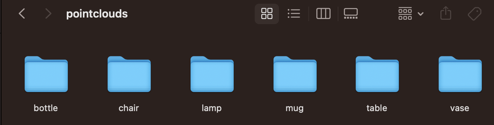

# Overview of Dataset Creation
This repository includes many point cloud examples from the original shapetalk dataset and utilizes some functions for visualizations from ChangeIt3Ds original repository.

## IMPORTANT: 
This is a largely stand alone folder but relies on you first uploading the point cloud class folders into the pointclouds repository in this folder! We did not load this to our repo based on the size of the point cloud files. If you have downloaded the Shapetalk repository you should have a pointclouds directory with subdirectories of different class names which downstream contain the npz files of point cloud data. Copy those class folders as is into our `pointclouds` directory which ensures you have all the relevant source and target objects available for each class. For our prep we had loaded the bottle, lamp, chair, mug, table, and vase subdirectories so to replicate our experiments you would need to do the same. 
Here are some screenshots to show our setup:
 
  
   

## runNoiseAndLanguageDatasetAndCSVs.py
The primary code to reference and utilize if you are building your own datasets to replicate our projects is:

*** runNoiseAndLanguageDatasetAndCSVs.py ***
It contains multiple functions to help assist with generating the csvs that can be used for our experiment tests. 

### genPCNoise()
This function makes use of the `gaussianhelper.py`function to add varying degrees of gaussian noise to point clouds that match the format from the ShapeTalk dataset. It currently is written with no input parrameters but could be reconfigured for generalizability. Current state it adds noise with the following sigma values:
`sigmas = [.003, .005, .008, .01, .015, .02, .025, .03, .035, .04, .045, .05, .055, .06, .065, .07, .075, .08, .085, .09, .1, .2]`
to any point cloud specified in the input directory (e.g. pcinput). The input directory is expected to contain subdirectories with a name of the corresponding class of point cloud objects it contains, and those directories should hold the npz formatted point cloud files for the objects you would like to apply noise to. Our pcinput directory contains subdirectories of bottle, chair, lamp, mug, and vase each with 100 npz point cloud files. It saves new npz files storing the point clouds in an output directory, pcoutput (note that for our experiments we updated this to be 100pcPerClassOutput as we ran more experiments, you can update this to your desired output directory), this directory is also expected to contain folders for the classes that we are generating outputs for. If you are running your own experiments consider refactoring this to dynamically create the directories you need - otherwise you just need to set up your directories accordingly.

### newCSVsForNoise()
This function utilizes the `shapetalk_preprocessed_public_version_0.csv`  file from the ChangeIt3D repository, located in our `data` directory and the data in pcinput to utilize existing utterance and token information from the preprocessed file where the source model was one of the models in the pcinput directory which we used as our basis for generating point clouds. We then use the same sigma set from genPCNoise i.e. 
        `sigmas = [.003, .005, .008, .01, .015, .02, .025, .03, .035, .04, .045, .05, .055, .06, .065, .07, .075, .08, .085, .09, .1, .2]`
and we specify filenames that we want to use for naming our new csv files, i.e.
        `fileNamesToGenerate = ['baseline_exp1', 'noiseSigma003_exp1', 'noiseSigma005_exp1', 'noiseSigma008_exp1', 'noiseSigma01_exp1', 'noiseSigma015_exp1', 'noiseSigma02_exp1', 'noiseSigma025_exp1', 'noiseSigma03_exp1', 'noiseSigma035_exp1', 'noiseSigma04_exp1', 'noiseSigma045_exp1', 'noiseSigma05_exp1', 'noiseSigma055_exp1', 'noiseSigma06_exp1', 'noiseSigma065_exp1', 'noiseSigma07_exp1', 'noiseSigma075_exp1', 'noiseSigma08_exp1', 'noiseSigma085_exp1', 'noiseSigma09_exp1', 'noiseSigma1_exp1', 'noiseSigma2_exp1']`
The output gets generated in the output directory. 

### newCSVsForLanguageManipulation()
This function utilizes the `shapetalk_preprocessed_public_version_0.csv` file from the ChangeIt3D repository, located in our data directory. We select 20 random rows based on if their utterances include any word in a set of words we predefined:
 `words = ['fat', 'thin', 'short', 'tall', 'wide', 'narrow', 'big', 'small', 'large', 'tiny', 'huge', 'little', 'massive', 'skinny', 'gigantic', 'petite', 'enormous', 'immense', 'miniscule', 'vast', 'circular', 'comfortable', 'soft', 'shorter', 'taller', 'girthy', 'sharp', 'round', 'bent', 'broader', 'narrower', 'curvy', 'flat', 'longer', 'shorter', 'straight', 'bumpy', 'smooth']`
 The user is then prompted to provide a new utterance which we then tokenize and generate the token embeddings for in order to include them in a new output csv (one for each class) which can then be used for later experiments. Note that this is currently configured only for the chair, lamp, and vase, classes so it would need to be refactored for use on other classes. 

### other functions 
Most other functions in runNoiseAndLanguageDatasetAndCSVs.py are simply helper functions of sorts: 
- `printEncodedTokens()` this was a helper function to off hand generate token_embeddings which was helpful for manual csv dataset prep for our part removal tests (see 'Notes on Part Removal Dataset prep)
- `displayPCsFromNoisyNpy()` this is a helper function for generating visuals of the noisy point clouds generated from genPCNoise() to view the extent of noise getting added
- `countContents()` this simply counts valid files in specific folders which helped verify we had 100 point clouds each in the pcinput class folders for our noise evaluation experiments 
- `displayPCsFromCustNpy()` this is a helper function we used after we ran our noise experiments. We had to store off the latent representations of the pcs and then the resulting transformed pointcloud. This was saved with a different data structure than the npz files otherwise used throughout the project to store point cloud data, so we had to write custom scripts to generate visualizations of the results of that experiment. 
- `displayPC()` simply another helper function for visualizing the point clouds 

 ## Notes on Part Removal Dataset prep
 To create a dataset of point clouds with segmented parts removed I repurposed the looking_inside_c3d_trained_system.ipynb notebook provided by ChangeIt3Ds repository. Review the `Copy of looking_inside_c3d_trained_system.ipynb` for my changes. Including some screenshots here: 
 
  

  High level you need to restrict your arguments to the desired class, utilize the segmentation training weights from ChangeIt3D for chair, table, or lamp, and then evaluate the part a given point was associated with, then mask the original point cloud so that we can save off a new point cloud of the part missing points with a specific part specification. 

 After we had removed specific parts of point clouds as new target comparison point clouds (for our part removal experiment), we needed to generate a csv to use to specify our pre-segmented parts as the target in the communication context to continue our experiment. We also needed to ensure that the utterances aligned with the intended part removal, e.g. there are no legs would be an appropriate utterance to then use for a target object with no legs. We did this experiment prior to some of our others, so in hind sight it would be more efficient to write a more complete script for more fluidly generate appropriate csvs. What we did was manually look through the `shapetalk_preprocessed_public_version_0.csv` and identified rows with appropriate utterances where the source object was one of the objects we had already segmented. This was somewhat time consuming to do and we used it to manually rebuild csv files for testing. 

## Notebooks:
There are a few notebooks included here from our Colab repo. In order to run these, they would need to be set up in Colab with downloaded data from [`optas/changeit3d`](https://github.com/optas/changeit3d?tab=readme-ov-file#shapetalk-dataset--rocket-). I wanted to share these in case they are helpful in your own testing endeavors. 
- `review_c3d_trained_system_with_part_segmentation.ipynb` - this was modified from ChangeIt3D' looking_inside_c3d_trained_system.ipynb notebookto help generate point clouds with removed parts as indicated in the Notes on Part Removal Dataset prep section above. 
- `datasetReview.ipynb` - this was used to help evaluate what data we had loaded in our initial colab repo as well as what data was utilized for the pretrained ChangeIt3D model we were utilizing and was used to generate some graphs on the dataset in the midterm report
- `evaluateDataset2.ipynb` - this was used to help evaluate what data we had loaded in our initial colab repo and was used to generate some graphs on the dataset in the midterm report

